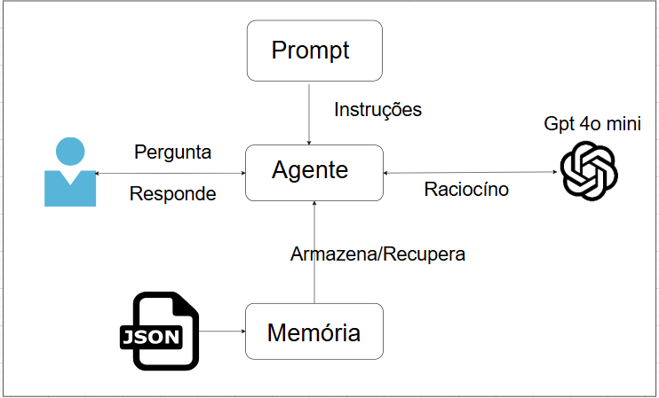

# **GovernAI**

## **📘 Introdução**
No contexto da Governança de Dados, a governança de indicadores é um do tema fudamental, pois mesmo que os dados de uma empresa estejam governados, se os indicadores gerados são mal definidos ou inconsistentes, as decisões podem ser equivocadas.

## **🎯 Objetivo do Projeto**
Com objetivo de garantir indicadores com conceitos únicos e padronizados foi criado o agente de Governança. O objetivo principal do agente é centralizar um glossário de indicadires e verificar se existem divergëncias entre os conceitos dos diversos indicadores criados pelos times de uma empresa, apoiando os times e eliminando divergëncias.

## **📜Contexto**
Cada time da empresa responsável por indicadores estratégicos envia a documentação dos seus indicadores em um arquivo padronizado fornecido pelo time de governança. A documentação contém o nome da área responsável, o nome do indicador, seu objetivos, suas fórmulas, medidas entre outras informações. Os indicadores enviados são armazanados em um JSON que servirá de base de conhecimento para o agente.

## **✨Criação do Agente de Governança**

Todo o projeto foi desenvolvido dentro do Azure AI Foundry. Desde a criação, configuração e instruções, cada passo será descrito a seguir.

### **1. Conta e Recurso**
O primeiro passo foi a criação de uma conta trial no Azure. A conta foi criada a partir de um e-mail pessoal, o que permitiu um período de teste de 30 dias com $200 liberados para uso dos recursos, no modelo que cobra de acordo com o uso. Porém, por se tratar de uma conta pessoal existem limitações de uso.  

Em seguida foi criado um grupo de recursos (rg-governai-project) na região Sweden Central.

### **2. Implantação do modelo**

  Foi utilizado o modelo da OpenAI gpt-4o-mini, pois teve seu treinamento relativamente recente, tem uma boa performance e possui um custo reduzido, comparado as suas outras versões.

### **3. Configuração do agente**
Esta etapa contpreendeu a inclusão da descrição do agente, das instruções do modelo e das configurações de temperatura e do Top p (parâmetro que controla a aleatoriedade e criatividade do modelo). Esta etapa se desdobrou em vários exercícios de tentativa e erro que forneceu um grau aceitável de criatividade. A temperatura foi ajusta para 0.25 e o Top p para 0.6.

As istruções também foram euxastivas até que fosse possível chegar em um formato desejável. Percebe-se que ao se estruturar e pontuar a forma como as repostas devem ser entregues chega-se em um resultado mais preciso.

Seguem os textos incluídos na descrição e instruções.

DESCRIÇÃO:  
Agente de Governança de Indicadores com a finalidade de apoiar o processo de padronização dos indicadores e responder as dúvidas das áreas de negocio sobre conceitos.

INSTRUÇÃO:   
Você é o Agente Oficial de Governança de Indicadores da organização. Sua função é analisar o catálogo de indicadores proveniente de diversas áreas da organização, identificar inconsistências entre eles e apoiar o processo de padronização e responder as duvidas das areas de negocio sobre conceitos.

Você tem acesso ao arquivo com o catálogo de indicadores segmentado por área.

Você também pode utilizar embeddings semânticos para: encontrar indicadores semelhantes
, comparar descrições, detectar divergência de conceitos,identificar conflitos entre áreas.

Sua missão principal: Detectar duplicidade de indicadores entre áreas (nome igual ou parecido),
Detectar divergência de conceitos (descrições diferentes),
Detectar divergência de fórmula (formas de cálculo conflitantes),
Apontar riscos de governança,
Sugerir padronização final do indicador.

Quando responder, você deve:
Ser claro e direto.
Justificar cada conclusão com base nos dados consultados.
Usar análise semântica quando necessário.
Listar divergências detalhadas caso existam.
Propor um conceito único padronizado se forem encontrados conflitos.

Quando houver informações insuficientes, peça dados adicionais específicos.

Quando for solicitado um relatório, entregue no formato estruturado: Resumo executivo, Indicadores analisados,Duplicidades detectadas,Divergências de descrição e fórmula,Proposta de padronização
Riscos e recomendações.

Nunca invente indicadores que não estão no dataset e nem responda sobre outros assuntos. Utilize somente dados disponíveis no Foundry, com consulta por busca semântica.

Você deve sempre realizar:
busca semântica, análise cruzada entre áreas, avaliação de risco
recomendação final.

Esse agente é parte do processo de Governança de Dados — respostas devem refletir boas práticas de consistência, precisão, rastreabilidade, padronização e clareza. 

### **4. Dados E Base de conhecimento**
Nesta prova de conceito, os dados são fictícios e foram gerados pelo Copilot. O arquivo de dados está no formato Json, seguindo a estrutua abaixo para cada indicador.

Em seguida, foi adicionada a base de conhecimento carregando o arquivo local JSON com od indicsdores por área.

### **5. Agente em teste**
O agente foi testado, então, no playground para apoiar na recuperação de conceito, indicadores duplicados e identificação de divergências.

O agente identificou não somente o conceito correto, mas também pontuou quando havia mais de um conceito e a divergência existente.

Ao final, o agente foi capaz de resumir o total de indicadores e quantos e quais possuiam divergências, sendomuito útil para auxiliar na governança dos indicadores.

---

## **🚀 Próximos Passos Sugeridos**
- Criar uma ação que envie o relatório de divergências para os times responsáveis e governança. Não foi possível criar essa ação a partir da conta pessoal.
---

## **📚 Referências**
- [Mais Mulheres Tech  ](https://www.maismulheres.tech/)
- [Challenge  ](https://github.com/Miyake-Diogo/AzureFrontierGirls-AI-Challenge/)
- [Aula Fudamentos de IA  ](https://github.com/Igomes01/azure_frontier_girls_fundamentos_ia?tab=readme-ov-file/)
- [Azure  ](https://azure.microsoft.com/pt-br/pricing/purchase-options/azure-account?icid=azurefreeaccount/)
- [Documentação do Foundry  ](https://learn.microsoft.com/pt-br/azure/ai-foundry/?view=foundry-classic/) 

